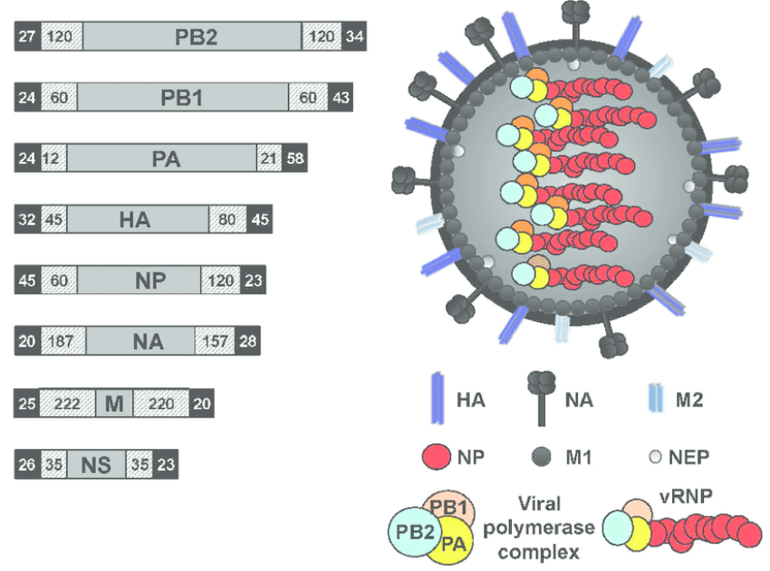
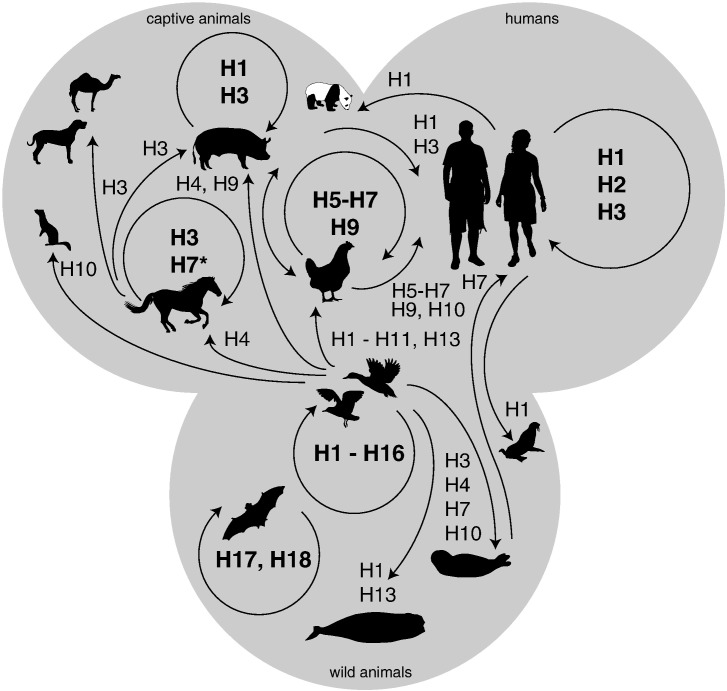

# Influenza Guidance Document

Authors
=======
Emily Smith,
Gültekin Ünal,
Gloria Kirabo,
Simeon Hebrew,
Nishat Tamanna,
Katherine Figueroa,
Daniel Akinyemi,
Gary Van Domselaar

# Introduction

Influenza remains a significant global health concern. Advances in
bioinformatics have provided unique opportunities for understanding
and combating this virus through genomic analysis. This document aims
to guide the public health community through the challenges of
standardized genomic analyses for Influenza and bring awareness to
open-source tools that can be used by either beginners or expert
bioinformaticians. Here, we outline comprehensive approaches
integrating both theoretical concepts and practical applications.

## Influenza Genomic Structure

The influenza A and influenza B genomes are segmented into eight pieces of
single-stranded negative-sense viral RNAs (vRNAs). Each of these
segments is characterized by conserved 5′ and 3′ termini,
segment-specific untranslated regions (UTRs), and typically contains
one large open reading frame (ORF). These genomic structures are
crucial for the virus's ability to use host cellular machinery for
replication and protein synthesis ([<u>Ferhadian et al, 2018</u>](https://www.frontiersin.org/journals/microbiology/articles/10.3389/fmicb.2018.00559/full)).

The viral RNAs are incorporated
into viral ribonucleoproteins (vRNPs), which consist of multiple
copies of nucleoprotein (NP) and RNA-dependent RNA polymerase complex (RdRp), composed of the polymerase basic 1 (PB1), polymerase basic 2 (PB2), and polymerase acidic (PA) subunits ([<u>Chauhan & Gordon, 2022</u>](https://link.springer.com/article/10.1007/s11262-022-01904-w)). This facilitates both the transcription of vRNA into viral mRNA, complete
with a 5′ cap and a 3′ poly(A) tail, and the replication of vRNA
through a complementary RNA (cRNA) intermediate. The matrix segment (M) encodes the M1 and M2 proteins that form a bridge between the nucleocapside and viral envelope. The non-structural gene (NS) encodes two proteins that play a role in evading the host innate immune response and export of viral ribonucleoproteins ([<u>Bouvier & Palese, 2008</u>](https://www.ncbi.nlm.nih.gov/pmc/articles/PMC3074182/)). 

There are two surface glycoproteins critical for viral and and release. The hemagglutinin (HA) protein is a multifunctional glycoprotein on the surface of the virus which is integral to infectivity, serving as an attachment factor and membrane fusion protein. The neuraminidase (NA) protein is another surface glycoprotein that faciliatates viral release from infected cells. Both HA and NA are "antigens", meaning they are capable of eliciting a host immune response ([<u>CDC, 2023</u>](https://www.cdc.gov/flu/about/viruses/types.htm)). 

**Figure 1**. Influenza A virus genome structure ([<u>Breen et al, 2016</u>](https://www.mdpi.com/1999-4915/8/7/179)).

## Public Health Relevance

The World Health Organization (WHO) estimates that influenza viruses
cause severe illness in 3 to 5 million people annually, resulting in
an average of \~650,000 deaths worldwide ([<u>Liluano et. al.,
2019</u>](https://www.ncbi.nlm.nih.gov/pmc/articles/PMC5935243/)).
Given the rapid evolution of influenza viruses, tracking their spread
and predicting future strains for effective vaccine development is a
challenging task. In recent years, bioinformatics has become crucial
for gaining insights into the genomics of influenza, providing a
wealth of information about potential origins, evolution, and
virulence ([<u>Shao et. al.,
2017</u>](https://www.ncbi.nlm.nih.gov/pmc/articlesPMC5578040/pdf/ijms-18-01650.pdf),[<u>Liu et. al., 2021</u>](https://pure.johnshopkins.edu/en/publications/differential-disease-severity-and-whole-genome-sequence-analysis-)).

## Seasonal Influenza

Seasonal influenza is an annual, worldwide occurrence that typically
causes acute respiratory infections with Influenza A or Influenza B
([<u>WHO</u>](https://www.who.int/news-room/fact-sheets/detail/influenza-(seasonal))).
Influenza A viruses are further classified into subtypes according to
the combinations of the hemagglutinin (HA) and
neuraminidase (NA) gene segments, which encode proteins on the surface
of the flu virus. Currently, circulating Influenza A subtypes include
A/H1N1 and A/H3N2. Influenza B viruses do not have subtypes, but can
instead be classified according to lineage, B/Yamagata or B/Victoria.
Influenza A is more prevalent earlier in the flu season, whereas
Influenza B becomes more prevalent later in the flu season. Genomic
surveillance for seasonal influenza focuses on the identification of
the flu type and subtype, and monitoring changes in those genotypes
over time. This surveillance is used to inform vaccine strain
selection for the following flu season, as well as a baseline from
which to detect new and emerging strains that might deviate from the
traditional seasonal pattern
([<u>WHO</u>](https://www.who.int/news-room/fact-sheets/detail/influenza-(seasonal)),
[<u>CDC</u>](https://www.cdc.gov/flu/pandemic-resources/index.htm)).

## Pandemic Influenza

Pandemic influenza remains a serious global threat. In contrast to
seasonal influenza, pandemic influenza occurs when a novel Influenza A
virus emerges that is more infectious and/or transmissible, to which
the majority of the human population has no underlying immunity
([<u>CDC</u>](https://www.cdc.gov/flu/pandemic-resources/index.htm)).
The most recent influenza pandemic began in 2009, caused by an H1N1
influenza strain resulting from a reassortment of swine, avian, and
human flu viruses ([<u>Trifonov et al,
2009</u>](https://www.nejm.org/doi/full/10.1056/NEJMp0904572)).
Historical pandemic influenza examples include the 1918 influenza
(“Spanish flu”), also caused by an H1N1 virus, the 1957 influenza
(“Asian flu”) caused by an H2N2 virus, 1968 influenza (“Hong Kong
flu”) caused by an H3N2 virus, and 1977 flu (“Russian flu”) caused by
an H1N1 virus ([<u>Michaelis et al,
2009</u>](https://link.springer.com/article/10.1007/s00430-009-0118-5)).
## Influenza in Animals

In recent decades, the highly pathogenic avian influenza (HPAI) virus,
specifically the H5N1 strain, has been a persistent concern due to its
detection in both domestic poultry and wild birds. Since 1997, this
virus has posed a significant threat to human health ([<u>Lee et al.,
2008</u>](https://www.ncbi.nlm.nih.gov/pmc/articles/PMC2570817/)).
However, the situation escalated dramatically towards the end of 2003,
as H5N1 strains of the influenza virus spread rapidly and extensively
throughout various Asian countries. These outbreaks resulted in over
170 human fatalities in Thailand, Vietnam, Cambodia, and Indonesia,
signalling the severity of the situation ([<u>Lee et al.,
2008</u>](https://www.ncbi.nlm.nih.gov/pmc/articles/PMC2570817/),
[<u>WOAH</u>](https://www.woah.org/en/home/)). Moreover, the economic
ramifications in the poultry industry were substantial, with
significant losses reported across the affected regions, including
South Korea in 2003, which marked the first official report of the
H5N1 subtype in the country's history. These events highlight the
urgent need for comprehensive research and preventive measures to
mitigate the risks associated with HPAI and its potential impact on
public health and the economy ([<u>Ramey et al.,
2022</u>](https://wildlife.onlinelibrary.wiley.com/doi/10.1002/jwmg.22171)).

The majority of avian influenza viruses (AIVs) belong to the low
pathogenic avian influenza virus (LPAIV) category, which typically
induces mild to no clinical signs in poultry. These signs may include
respiratory symptoms, a slight decline in egg production, and a modest
increase in mortality rates (*94/EC of 20 December 2005 on Community
measures for the control of avian influenza and repealing Directive
92/40/EEC*). However, AIV subtypes H5 and H7 have the capacity to
undergo genetic changes, leading to the emergence of highly pathogenic
avian influenza viruses (HPAIVs). In poultry, HPAIVs cause severe
systemic infections and substantially higher mortality rates
([<u>Germeraad et al.,
2020</u>](https://www.frontiersin.org/articles/10.3389/fvets.2020.00237/full)).  
  
In 2009, the swine flu pandemic caused by H1N1/swine flu/influenza was
the third pandemic. This new strain of H1N1 resulted from a previous
reassortment of bird, swine, and human flu viruses, and finally with a
Eurasian pig flu virus. Swine play a significant role in the
transmission of influenza viruses. Although it had remained
antigenically stable since its first diagnosis in 1930 until 2009, a
novel influenza virus emerged through reassortment. Figure X illustrates
how reassortment occurred between avian and swine viruses in the cases
of swine flu that emerged in 2009.  
  
A new report from US officials discusses cases of highly pathogenic
avian influenza A(H5N1) virus infection in domestic dairy cattle and
cats in the United States in 2024, attributed to the clade 2.3.4.4b
virus. It emphasizes the systemic illness observed in infected cattle,
characterized by diminished milk production and significant virus
shedding in milk. Furthermore, the report notes a high mortality rate
among domestic cats fed raw colostrum and milk from affected cows,
suggesting cross-species transmission of the virus. Phylogenetic
analysis of hemagglutinin (HA) and neuraminidase (NA) gene sequences
indicates a substantial similarity between viruses isolated from both
bovine milk and cat tissues. The HA sequences are clustered with other
H5N1 viruses within clade 2.3.4.4b, indicating a shared ancestry, while
the NA sequences are grouped within the N1 subtype of highly pathogenic
avian influenza viruses. This genetic relatedness underscores the
potential for cross-species transmission, emphasizing the necessity for
ongoing surveillance to curtail further dissemination ([<u>Burrough et
al., 2024</u>](https://wwwnc.cdc.gov/eid/article/30/7/24-0508_article)).

**Figure 3.** Reservoirs and inter-species transmission events of pathogenic avian influenza viruses. \*H7N7
virus emerged amongst horses in the 1950s but is currently thought to be
extinct. ([<u>Short et al, 2015 </u>](https://www.ncbi.nlm.nih.gov/pmc/articles/PMC4542011/))

## Sequencing for Influenza

### Gene Sequencing

Prior to the rapid adoption of whole genome sequencing (WGS),
sequencing of the individual gene segments, often the HA and NA gene
segments, was a common approach to characterizing influenza. The
advent of NGS broadened its scope, enabling comprehensive analyses of
viruses like influenza. It now enables quick pathogen identification,
comparing virus sequences with phylogenetics, notably haemagglutinin
and neuraminidase, with existing databases to identify virus subtypes,
relationships, and drug resistance. Furthermore, this reduces the need
for time-consuming virus culturing while simultaneously allowing for
more comprehensive analysis ([<u>Houghton et. al.,
2017</u>](https://pubmed.ncbi.nlm.nih.gov/28104386/)).

### Whole-genome Analysis

The WGS technique is now used worldwide and provides deep insights
into Influenza virus genotypes, evolution, and genetic reassortment.
It's instrumental for early detection, tracking virus origins, and
deciphering virus emergence mechanisms. Moreover, converting
nucleotide sequences into amino acids helps understand traits like
host range and predicted drug susceptibility.

### Influenza in wastewater

Influenza can also be detected through wastewater surveillance, whereby
laboratories can determine the viral concentration of different
influenza types and subtypes in wastewater. This surveillance method is
fairly new but is quickly being adopted by public health laboratories
worldwide looking to increase capacity for respiratory virus
surveillance in different populations ([<u>Zheng et. al.,
2023</u>](https://pubmed.ncbi.nlm.nih.gov/37741039/)).

### Bioinformatics in Public Health

The use of bioinformatics in studying influenza viruses enhances
public health laboratories in several aspects:

-   Monitoring the genetic makeup of circulating influenza viruses.

-   Identifying emerging pandemic strains.

-   Detecting mutations leads to alertness for challenges like drug
    resistance.

-   Facilitating early season risk assessment and improving vaccine
    selection for the upcoming year.

Various web platforms, such as the **Influenza Research
Database/Fludb**, **Nextflu**, and **OpenFluDB**, offer extensive
functionalities for such analyses.

### Standard Bioinformatics Workflow

Platforms like INSaFLU guide the influenza bioinformatics workflow,
starting with the collection of NGS reads. Quality control tools,
including FastQC and Trimmomatic, ensure the accuracy of these reads.
The workflow then moves to reference-based mapping for genomic
surveillance, encompassing mutation detection, consensus sequence
creation, and intricate phylogenetic analysis. The high-quality reads
are further examined against influenza-typing databases, ensuring
precise virus classification and resistance tracking.

### Bioinformatics Tools for Influenza

Multiple bioinformatics tools and workflows are available for
analyzing influenza NGS data for both long-read and short-read
platforms. For instance, tools like InsaFLU and BV-BRC Genome Assembly
support both Illumina and ONT data.

InsaFlu and BV-BRC offer a graphical user interface for users without
command-line experience which might be helpful for public health
professionals. On the other hand IRMA, by the CDC, is command-line-based
and tailored for Illumina data (Also supports long reads). Furthermore,
this tool can be run via workflows like nf-flu on NextFlow Tower and
TheiaCov on Terra.bio.

### Online Bioinformatics Resources**

**Table 2.** Overview of Bioinformatics Tools for Genome Assembly and
Characterization - Features, Platform Compatibility, and Limitations

| Tool                                                                                  | Description                                                                                     | Web version | CLI version | Terra | Nextflow |
|---------------------------------------------------------------------------------------|-------------------------------------------------------------------------------------------------|-------------|-------------|-------|----------|
| [<u>INSaFLU</u>](https://insaflu.insa.pt/)                                            | Genome assembly and characterization on Illumina, Oxford Nanopore, and Ion Torrent data         | Yes         | Yes         | Yes   | No       |
| [<u>NF-Flu</u>](https://github.com/peterk87/nf-flu)                                   | Genome assembly and characterization                                                            | No          | Yes         | No    | Yes      |
| [<u>TheiaCoV</u>](https://github.com/theiagen/public_health_bioinformatics/tree/main) | Genome assembly and characterization on Illumina and Oxford Nanopore data                       | No          | Yes         | Yes   | No       |
| [<u>BV-BRC</u>](https://www.bv-brc.org/app/Assembly2)                                 | Genome assembly on Illumina or Oxford Nanopore data                                             | Yes         | No          | No    | No       |
| [<u>IRMA</u>](https://wonder.cdc.gov/amd/flu/irma/)                                   | Genome assembly and characterization on Illumina, Oxford Nanopore, PacBio, and Ion Torrent data | No          | Yes         | N/A   | No       |
| [<u>LABEL</u>](https://wonder.cdc.gov/amd/flu/label/)                                 | Genome characterization                                                                         | No          | Yes         | No    | No       |
| [<u>MIRA</u>](https://github.com/CDCgov/MIRA)                                         | Quality, Assembly, annotation and report of mutations. For Illumina and Nanopore                | No          | Yes         | N/A   | N/A      |

### Phylogenetic Analysis Tools

For phylogenetic studies on influenza, the segmented nature of its
genome is a crucial factor. Instead of analyzing the entire genome,
trees are typically constructed for individual gene segments, with the
segment choice hinging on the specific research question. For
instance, when the goal is to evaluate how clinical samples diverge
from a vaccine strain, the HA segment is prioritized because it's the
primary target for the host's immune response. On the other hand,
monitoring the evolution of resistance to antiviral medications like
oseltamivir and zanamivir calls for a focus on the NA gene. However, a
comprehensive view of influenza genomes' relatedness or insights into
transmission patterns and potential reassortment events might
necessitate analyses across all eight gene segments. While
reassortment is a frequent occurrence in animal hosts and has
historically preceded global pandemics, it's less of a concern for
seasonal influenza due to its sustained human-to-human transmission.
The phylogenetic bioinformatics tools used for influenza are often the
same ones employed for sequence alignments and tree building in other
pathogens.

## Online Bioinformatics Resources

### Visualization platforms

[**<u>Nextstrain</u>**](https://nextstrain.org/)

[<u>Nexstrain</u>](https://nextstrain.org/) is an open-source
visualization platform that contains frequently updated phylogeny for
many pathogens, which include seasonal, emerging, and historical
influenza [<u>builds</u>](https://nextstrain.org/influenza/) using
publicly available genomic data from
[<u>GISAID</u>](https://gisaid.org/).

The real-time tracking of seasonal influenza evolution allows public
health scientists to monitor spread within and between different
geographic locations and evaluate divergence from seasonal vaccine
strains. The builds for subtypes seen more frequently in animal hosts
can be used to monitor subsequent spread from spillover events and to
determine whether any of the rare human infections with this subtype
are more closely associated with genomes from a specific host type.
Another feature of Nextstrain builds is the ability to switch between
different influenza gene segments in the builds, or between different
tree options. The “clock” view estimates the substitution rate for the
clade of interest, which can be used to determine whether particular
clades are evolving at different rates. The “scatter” view allows
users to visualize the genomic data on a plot using different metadata
fields to identify events of interest, or simply to describe the
distribution of genomic data across different strata.

[**<u>BV-BRC</u>**](https://www.bv-brc.org/view/Taxonomy/11320#view_tab=overview)

BV-BRC (Bioinformatics Visualization for Bacterial and Viral Research
and Characterization) is an advanced, user-friendly platform designed
for the comprehensive analysis and visualization of bacterial and
viral genomes. Like Nextstrain, BV-BRC focuses on providing up-to-date
phylogenetic information, but it extends its utility to a wider range
of pathogens, including both bacteria and viruses. It integrates
genomic data from diverse sources, including GISAID, for a holistic
view of pathogen evolution and spread.

Key features of BV-BRC include its ability to handle data from various
sequencing platforms, such as Illumina and Oxford Nanopore, offering
researchers flexibility in data analysis. The platform supports the
assembly, annotation, and comparison of genomic sequences,
facilitating detailed insights into pathogen biology and epidemiology.
BV-BRC's visualization capabilities are particularly noteworthy. It
offers interactive tools for exploring genomic data, enabling
researchers to trace pathogen transmission pathways, identify
mutations of interest, and understand the genetic diversity within and
across different populations. This makes it an invaluable resource for
epidemiological studies, vaccine development, and public health
surveillance.

**[<u>Auspice</u>](https://auspice.us/) -** Auspice is an interactive
tool for visualizing phylogenomic datasets and phylogenetic trees on
Nextstrain. Users can upload JSON or Newick files directly to the web
version. If created with the Augur pipeline, the tree includes branch
annotations, mutations, clade, and lineage details. Associated metadata
in CSV or TSV formats can also be uploaded to customize sequence labels
and colors.

**[<u>Microreact</u>](https://microreact.org/) -** This is an open data
visualization tool for genomic epidemiology for phylogenomics and
metadata association. The tool takes a Newick file and metadata in TSV
format for performing visualization and for sharing the project.

### Genomic Databases

**Table 3.** This table provides an overview of various databases
relevant to the study and management of influenza and details their
description, data source, accessibility and maintenance information

| **Database**                                                             | **Description**                                                                                                                                                                                                                                                                       | **Data source**                                                                                | **Accessibility** | **Maintenance**                                                                                                               |
|--------------------------------------------------------------------------|---------------------------------------------------------------------------------------------------------------------------------------------------------------------------------------------------------------------------------------------------------------------------------------|------------------------------------------------------------------------------------------------|-------------------|-------------------------------------------------------------------------------------------------------------------------------|
| [**<u>NCBI Virus</u>**](https://www.ncbi.nlm.nih.gov/labs/virus/vssi/#/) | Integrative, open-source resource to display and analyze a curated collection of genomes from NCBI                                                                                                                                                                                    | Uploaded by users                                                                              | Public            | NCBI Virus team                                                                                                               |
| [**<u>OpenFluDB</u>**](https://openflu.vital-it.ch/browse.php)           | Open database for browsing and analyzing whole influenza genomes or specific gene segments                                                                                                                                                                                            | Uploaded by users and imported from GenBank                                                    | Public            | Swiss Institute of Bioinformatics                                                                                             |
| [**<u>GISAID EpiFlu</u>**](https://www.gisaid.org/)                      | Resource for browsing influenza genomes, viewing phylodynamics, and visualizing trends over time                                                                                                                                                                                      | Uploaded by users and imported from GenBank                                                    | Restricted        | Unknown                                                                                                                       |
| [**<u>BV-BRC</u>**](https://www.bv-brc.org/)                             | The Bacterial and Viral Bioinformatics Resource Center (BV-BRC) is an information system designed to support the biomedical research community’s work on bacterial and viral infectious diseases via the integration of vital pathogen information with rich data and analysis tools. | Data is often sourced from various research projects, collaborations, and public repositories. | Public            | National Institute of Allergy and Infectious Diseases, National Institutes of Health, Department of Health and Human Services |

## Data Analysis for Influenza

### Mutation Analysis

Influenza viruses exhibit high mutation rates due to RNA polymerase,
especially influenza A and B. This rate could lead to antigenic drift
and some other gradual changes. The mutation rate is not stable
throughout the genome, but HA and NA are generally the most variable
ones and they rely on the host’s immune system response. For influenza,
the rate is between 2.3 to 2.5 x 10^-3 substitutions per site per year
for HA. The substitution of HA is the highest and this variability shows
the importance of routine surveillance efforts ([<u>Shao et al.,
2017</u>](https://www.ncbi.nlm.nih.gov/pmc/articles/PMC5578040/pdf/ijms-18-01650.pdf)).

## Drug Resistance

Drug resistance in influenza viruses poses a significant challenge to
treatment efforts. These treatment options consist of medications like
neuraminidase inhibitors (oseltamivir, zanamivir) and M2 ion channel
blockers (amantadine, rimantadine). The mutations in the genome could
alter the drug binding sites which leads to reduced efficacy of the
drug. The prevalence of drug-resistant strains varies over time and by
geographical location. This is why every year some influenza samples
are collected from all over the world as a surveillance effort and are
put into the next year’s influenza vaccine development, which is led
by the World Health Organization (WHO). It’s really important to keep
in mind that drug resistance is an evolving process and has regular
updates every year.

### Drug Resistance Databases

Drug resistance databases allow us to analyze your segment fasta files
for investigating drug resistance in the genome.

[<u>FluR</u>](https://gitlab.sib.swiss/clinbio/spsp-ng/spsp-ng-bioinformatics/pipelines/influenza-resistance):  Tool for calling resistance mutations from Influenza sequences.
Currently, the tool comes with reference mutations for PA and NA as
listed by the WHO\*.

The folder "reference_datasets" contains:

-   WHO mutations lists (converted from PDF to TSV files):

    -   Human PA:
        [<u>https://www.who.int/publications/m/item/summary-of-polymerase-acidic-(pa)-protein-amino-acid-substitutions-analysed-for-their-effects-on-baloxavir-susceptibility</u>](https://www.who.int/publications/m/item/summary-of-polymerase-acidic-(pa)-protein-amino-acid-substitutions-analysed-for-their-effects-on-baloxavir-susceptibility)

    -   Human NA:
        [<u>https://www.who.int/publications/m/item/summary-of-neuraminidase-(na)-amino-acid-substitutions-associated-with-reduced-inhibition-by-neuraminidase-inhibitors-(nais)</u>](https://www.who.int/publications/m/item/summary-of-neuraminidase-(na)-amino-acid-substitutions-associated-with-reduced-inhibition-by-neuraminidase-inhibitors-(nais))

-   A description file which assigns a reference protein FASTA and
    mutations file for each type/subtype/lineage/protein. The
    corresponding FASTA and mutations files are expected in the
    "reference_datasets" folder. The description file may be extended
    to other Influenza types and proteins.

\*Currently implemented for human Influenza for proteins PA and NA.

**[<u>Fluserver</u>](https://flusurver.bii.a-star.edu.sg/)**

FluSurver is a powerful tool designed for identifying mutations in
influenza viruses that may have significant phenotypic or
epidemiological implications. Its primary application is in the research
domain, where it helps highlight mutations worthy of further
investigation. By using FluSurver, researchers can pinpoint candidate
mutations for more in-depth experimental testing and verification,
aiding in the understanding of how specific mutations affect virus
behavior and impact.

The tool is particularly effective when used with sequences that closely
relate to contemporary human infections and current vaccine strains.
This specificity enhances the relevance and reliability of the results,
especially when dealing with surveillance sequences. FluSurver is also
equipped to handle sequences from avian influenza strains like H5N1,
H5N6, H5N8, and H7N9, as well as novel reassortant swine flu strains
such as H3N2v. This breadth allows researchers to explore a wide array
of influenza viruses using a single computational platform.

#### Antigenic Drift and Shift Analysis
Antigenic drift refers to the continuous process which leads to
genetic mutation in the genome of Influenza viruses. These slow
mutations primarily affect the virus's various sites such as surface
proteins, hemagglutinin (HA) and neuraminidase (NA). These mutations
have been changing the structure of antigenic properties of the virus
as they accumulate over time. Antigenic shift, on the other hand, is a
sudden and major change in the Influenza A viruses which results in
the new HA and NA subtypes of novel viruses. This shift occurs when
two different subtypes of influenza viruses infect the same host cell.
This change has contributed populations becoming susceptible to the
new influenza viruses. This change can easily lead to the rapid spread
of viruses and sometimes unfortunately to pandemics (H1N1 pandemic in
2009) ([<u>Shao et al.,
2017</u>](https://www.ncbi.nlm.nih.gov/pmc/articles/PMC5578040/pdf/ijms-18-01650.pdf)).

## Case Studies: Successful Bioinformatics Applications in Influenza Research

## Human influenza

1.  Scientists in the UK applied whole-genome sequencing to an influenza
    A outbreak investigation on the hematology/oncology ward at a
    National Health Service (NHS) hospital in London ([<u>Houlihan et
    al,
    2018</u>](https://academic.oup.com/jid/article/218/9/1485/5033093)).
    Through phylogenetic analyses of the sequence data, the authors
    concluded that the nosocomial influenza cases were the result of
    two separate introduction events, instead of a larger, single
    outbreak. This has direct public health implications for infection
    control practices in hospitals, and additionally to the morbidity
    associated with influenza infections.

2.  In a study by scientists at Johns Hopkins and Chang Gung Memorial
    Hospital, it was determined that H1N1pdm influenza genomes
    belonging to the 6B.2 clade resulted in more severe clinical
    disease compared to genomes of the 6B.1 clade ([<u>Liu et al,
    2021</u>](https://academic.oup.com/ve/article/7/1/veab044/6261952)).
    These types of analyses incorporating both genomic and
    epidemiologic data enhance public health understanding of clinical
    influenza as a whole, while providing important context to
    influenza genotyping schemes.

3.  Most recently, the United Kingdom Health Security Agency (UKHSA)
    used whole-genome sequencing to confirm detection of a human case
    of H1N2 ([<u>UKHSA,
    2023</u>](https://www.gov.uk/government/news/ukhsa-detects-human-case-of-influenza-ah1n2v)).
    This was the first time this particular subtype had been detected
    in a human in the UK. Using whole-genome sequencing, the UKHSA
    determined that this sample belonged to clade 1b.1.1, which is
    distinct from other H1N2 human cases worldwide, and more similar
    to strains currently circulating in swine in the UK. The genome
    segments were submitted to GISAID on the same day the announcement
    was made and are accessible to those with GISAID login credentials
    (EPI_ISL_18548251).

 ## Latest Updates

The United States Department of Agriculture recently reported the
detection of Highly Pathogenic Avian Influenza (HPAI) A (H5N1) clade
2.3.4.4b virus in dairy cattle, marking the first instance of this
virus clade affecting domestic cattle as of March 2024 ([<u>USDA,
2024</u>](https://www.aphis.usda.gov/livestock-poultry-disease/avian/avian-influenza/hpai-detections/livestock)).
A recent study by [<u>Xiao Hu et al
presents</u>](https://www.biorxiv.org/content/10.1101/2024.04.16.588916v1)
genetic characterization of HPAI viruses from dairy cattle that
experienced a sudden decline in milk production. These viruses belong
to a newly identified genotype B3.13 within the clade 2.3.4.4b. Since
2023, the B3.13 viruses have undergone two reassortment events and
exhibit significant mutations in the HA, M1, and NS genes. However,
they do not possess mutations in the PB2 and PB1 genes, which are
known to enhance virulence or adaptation in mammals. The detection of
the PB2 E627K mutation in a human case linked to these viruses
underlines the capability for rapid viral evolution after infection
and emphasizes the critical need for ongoing surveillance to address
potential public health threats. This discovery is crucial as it
expands our understanding of the host range of HPAI viruses and the
genetic mechanisms that may facilitate their adaptation to new hosts.

## Training Resources

1- Galaxy Training: In this tutorial, you are going to work on a single
avian influenza sample sequenced in paired-end mode on the Illumina
platform, i.e. you are going to download two datasets of sequenced reads
for that sample. In this exercise, participants are going to base the
analysis on a small collection of multiple reference sequences for each
influenza gene segment. This exercise was prepared this collection for
you from public INSAFlu data. *Link of the training*: [<u>Avian
influenza viral strain analysis from gene segment sequencing
data</u>](https://training.galaxyproject.org/training-material/topics/variant-analysis/tutorials/aiv-analysis/tutorial.html)

2- ECDC: This course aims to enhance knowledge of the basic
bioinformatics tools available for the analysis of sequencing data and
for the interpretation, comparison and analysis of influenza sequence
data, with a focus on haemagglutinin and neuraminidase genes. *Link of
the training*: [<u>Influenza Bioanalytics
course</u>](https://eva.ecdc.europa.eu/course/view.php?id=227)

3- ECDC: This virtual training aims to introduce public health
participants to theoretical and practical aspects of analyzing avian
influenza sequence data from single samples, using a one-health
approach. Participants will get insights on NGS data analysis (including
data quality control) and genotyping, and their use in the context of
avian influenza outbreak investigations. *Link of the training*:
[<u>Avian influenza NGS data analysis for outbreak investigation from a
one-health
perspective</u>](https://eva.ecdc.europa.eu/course/view.php?id=845)

## Public Health Importance of Influenza

The objective of public health management of influenza focuses on
reducing the incidence, morbidity, and mortality associated with
seasonal epidemics and potential pandemics. This goal is achieved
through comprehensive surveillance systems that monitor circulating
strains for changes in virulence, antigenic characteristics (drift and
shift), and resistance patterns to antiviral medications. Public health
strategies include the development and distribution of annual influenza
vaccines (yearly) tailored to match the predominant circulating strains,
promoting vaccination among high-risk populations (such as the elderly,
healthcare workers, and those with chronic health conditions and
children), and implementing antiviral treatment guidelines.
Additionally, public health measures aim to enhance global and local
preparedness for potential influenza pandemics through the stockpiling
of vaccines and antivirals, developing rapid response capabilities, and
promoting public education on hygiene practices to reduce transmission.
These efforts are coordinated at both national and international levels,
involving organizations like the WHO, to ensure a unified and effective
response to influenza outbreaks and the most important part to
accomplish those goals is the global genomic surveillance of influenza.

## References

1.  Luliano A.D., Roguski K.M., Chang H.H., Muscatello D.J., Palekar R.,
    Tempia S., et al. Estimates of global seasonal
    influenza-associated respiratory mortality: a modelling study.
    Lancet. 2018;391(10127):1285–1300

2.  Shao, W., Li, X., Goraya, M. U., Wang, S., & Chen, J.-L. (2017).
    Evolution of Influenza A Virus by Mutation and Re-Assortment.
    International Journal of Molecular Sciences, 18(8), 1650.

3.  Liu, H., Gong, Y.-N., Shaw-Saliba, K., Mehoke, T., Evans, J., Liu,
    Z.-Y., Lewis, M., Sauer, L., Thielen, P., Rothman, R., Chen,
    K.-F., & Pekosz, A. (2021). Differential disease severity and
    whole-genome sequence analysis for human influenza A/H1N1pdm virus
    in the 2015–2016 influenza season. Virus Evolution, 7(1), veab044.

4.  World Health Organization. (2023, October 3). *Influenza
    (seasonal)*. WHO. Retrieved April 19, 2024, from
    <https://www.who.int/news-room/fact-sheets/detail/influenza-(seasonal)>

5.  Centers for Disease Control and Prevention. (May 2019). Pandemic
    flu. CDC. Retrieved April 19, 2024, from
    https://www.cdc.gov/flu/pandemic-resources/index.htm

6.  Trifonov, V., Khiabanian, H., & Rabadan, R. (2009). Geographic
    dependence, surveillance, and origins of the 2009 influenza A
    (H1N1) virus. The New England Journal of Medicine, 361(1),
    115-119. https://doi.org/10.1056/NEJMp0904572

7.  Michaelis, M., Doerr, H. W., & Cinatl, J. Jr. (2009). Novel
    swine-origin influenza A virus in humans: another pandemic
    knocking at the door. Medical Microbiology and Immunology, 198,
    175-183.

8.  Lee, Y.-J., Choi, Y.-K., Kim, Y.-J., Song, M.-S., Jeong, O.-M., Lee,
    E.-K., Jeon, W.-J., Jeong, W., Joh, S.-J., Choi, K.-S., Her, M.,
    Kim, M.-C., Kim, A., Kim, M.-J., Lee, E. H., Oh, T.-G., Moon,
    H.-J., Yoo, D.-W., Kim, J.-H., Sung, M.-H., Poo, H., Kwon, J.-H.,
    & Kim, C.-J. (2008). Highly pathogenic avian influenza virus
    (H5N1) in domestic poultry and relationship with migratory birds,
    South Korea. Emerging Infectious Diseases, 14(3), 487-490.

9.  Ramey, A. M., Hill, N. J., DeLiberto, T. J., Gibbs, S. E. J.,
    Hopkins, M. C., Lang, A. S., Poulson, R. L., Prosser, D. J.,
    Sleeman, J. M., ... (2022). Highly pathogenic avian influenza is
    an emerging disease threat to wild birds in North America. The
    Journal of Wildlife Management, 86(2), Article e22171.

10. World Organisation for Animal Health. (n.d.). Avian influenza. WOAH.
    Retrieved April 19, 2024, from
    [<u>https://www.woah.org/en/disease/avian-influenza/</u>](https://www.woah.org/en/disease/avian-influenza/)

11. Germeraad, E. A., Elbers, A. R. W., de Bruijn, N. D., Heutink, R.,
    van Voorst, W., Hakze-van der Honing, R., Bergervoet, S. A.,
    Engelsma, M. Y., van der Poel, W. H. M., & Beerens, N. (2020).
    Detection of low pathogenic avian influenza virus subtype H10N7 in
    poultry and environmental water samples during a clinical outbreak
    in commercial free-range layers, Netherlands 2017. Frontiers in
    Veterinary Science, 7, Article 237.

12. Short, K. R., Richard, M., Verhagen, J. H., van Riel, D.,
    Schrauwen, E. J. A., van den Brand, J. M. A., Mänz, B., Bodewes,
    R., & Herfst, S. (2015). One health, multiple challenges: The
    inter-species transmission of influenza A virus. One Health, 1,
    1-13.

13. Houghton, R., Ellis, J., Galiano, M., Clark, T. W., & Wyllie, S.
    (2017). Haemagglutinin and neuraminidase sequencing delineate
    nosocomial influenza outbreaks with accuracy equivalent to whole
    genome sequencing. Journal of Infection, 74(4), 377-384.

14. Zheng, X., Zhao, K., Xu, X., Deng, Y., Leung, K., Wu, J. T.,
    Leung, G. M., Peiris, M., Poon, L. L. M., & Zhang, T. (2023).
    Development and application of influenza virus wastewater
    surveillance in Hong Kong. Water Research, 245, Article 120594.

15. UK Health Security Agency. (2023, November 27). UKHSA detects human
    cases of influenza A(H1N2)v. Retrieved from
    <https://www.gov.uk/government/news/ukhsa-detects-human-case-of-influenza-ah1n2v>

16. Houlihan, C. F., Frampton, D., Ferns, R. B., Raffle, J., Grant, P.,
    Reidy, M., Hail, L., Thomson, K., Mattes, F., Kozlakidis, Z.
    (2018). Use of Whole-Genome Sequencing in the Investigation of a
    Nosocomial Influenza Virus Outbreak. The Journal of Infectious
    Diseases, 218(9), 1485

17. Hu, X., Saxena, A., Magstadt, D. R., Gauger, P. C., Burrough, E.,
    Zhang, J., Siepker, C., Mainenti, M., Gorden, P. J., Plummer, P.,
    & Li, G. (2024). Highly pathogenic avian influenza A (H5N1) clade
    2.3.4.4b virus detected in dairy cattle. bioRxiv.

18. Fodor, E., & te Velthuis, A. J. W. (2020). Structure and function of
    the influenza virus transcription and replication machinery. Cold
    Spring Harbor Perspectives in Medicine, 10(9), Article a038398.

19. Burrough, E.R., Magstadt, D.R., Petersen, B., Timmermans, S.J.,
    Gauger, P.C., Zhang, J., Siepker, C., Mainenti, M., Li, G.,
    Thompson, A.C., Gorden, P.J., Plummer, P.J., & Main, R. (2024).
    Highly Pathogenic Avian Influenza A(H5N1) Clade 2.3.4.4b Virus
    Infection in Domestic Dairy Cattle and Cats, United States, 2024.
    Emerging Infectious Diseases, 30(7).

20. Qu, Y., Zhang, R., Cui, P., Song, G., Duan, Z., & Lei, F. (2011).
    Evolutionary genomics of the pandemic 2009 H1N1 influenza viruses
    (pH1N1v). Virology Journal, 8, 250

21. Breen, M., Nogales, A., Baker, S. F., & Martínez-Sobrido, L. (2016). Replication-competent influenza A viruses expressing reporter genes. Viruses, 8(7), 179.

22. Ferhadian, D., Contrant, M., Printz-Schweigert, A., Smyth, R. P., Paillart, J. C., & Marquet, R. (2018). Structural and functional motifs in influenza virus RNAs. Frontiers in microbiology, 9, 354580.

23. Chauhan, R. P., & Gordon, M. L. (2022). An overview of influenza A virus genes, protein functions, and replication cycle highlighting important updates. Virus Genes, 58(4), 255-269.

24. Bouvier, N. M., & Palese, P. (2008). The biology of influenza viruses. Vaccine, 26, D49-D53.
