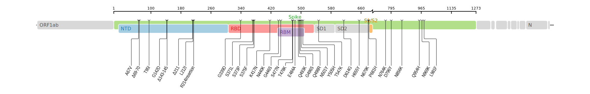

# Omicron Variant Resources

**PHA4GE Bioinformatics Pipelines &amp; Visualization Working Group**  
Libuit KG, Spinler JK, Southgate J, Black A, Nekrutenko A, Neuhaus B, O’Cathail C, Lemmer D, Jones D, Smith E, Gnimpieba E, Guthrie J, Maturure P, Monsierurs P, Maier W, Langhorst B, Page A, & Niewiadomska AM 

 
 Document Change Log

 
- 2021-12-19:
  - Added section detailing Omicron lineage and clade nomenclature, COVID-19 scenario modeling resource, and additional reference sequences
  - Updated Pangolin and Nextclade software minimums and resource links for genomic information (e.g. defining mutations), visualizations, and global case counts over time to include B.1.1.529 sub lineages

# Overview

The [World Health Organization (WHO) has classified the SARS-CoV-2 B.1.1.529 variant as a Variant of Concern (VOC)](https://www.who.int/news/item/26-11-2021-classification-of-omicron-(b.1.1.529)-sars-cov-2-variant-of-concern) under the advice of the [Technical Advisory Group on SARS-CoV-2 Virus Evolution (TAG-VE)](https://www.who.int/groups/technical-advisory-group-on-sars-cov-2-virus-evolution)—an independent group of experts that periodically monitors and evaluates the evolution of SARS-CoV-2 and assess if specific mutations and combinations of mutations alter the behavior of the virus. The WHO has assigned the B.1.1.529 VOC the label Omicron per [their greek-letter key variant assignment system](https://www.who.int/news/item/31-05-2021-who-announces-simple-easy-to-say-labels-for-sars-cov-2-variants-of-interest-and-concern).  The elevation of Omicron to a WHO-designated VOC was based on the TAG-VE's assessment of the variant’s large number of genomic mutations and plausible impact on COVID-19 epidemiology. 

The PHA4GE Pipelines and Visualization Working Group has created this document to highlight critical open-source/accesses resources to aid in the understanding and further analysis of the Omicron variant. 

In no way does this document represent a comprehensive list of all available SC2 bioinformatics resources. If this document fails to include a valuable public health resource or in some way mischaracterizes a resource mentioned, we encourage community collaboration through pull-requests and/or raised GitHub issues.

## Contents
- [General Information on the Omicron Variant](#general-information-on-the-omicron-variant)
	- [Omicron Lineage and Clade Nomenclature](#omicron-lineage-and-clade-nomenclature)
	- [Educational Material](#educational-material)
	- [Public Health Announcements and Publications](#public-health-announcements-and-publications)
	- [Technical Details and Global Trackers](#technical-details-and-global-trackers)
	- [Phylogenetic Visualizations](#phylogenetic-visualizations)
	- [Data Reporting and Sharing](#data-reporting-and-sharing)
- [Potential impacts of Spike Protein Mutations](#potential-impacts-of-spike-protein-mutations)
    - [Diagnostic and Sequencing Assays](#diagnostic-and-sequencing-assays)
- [Bioinformatics Resources and Considerations](#bioinformatics-resources-and-considerations)
    - [Software Version Minimums](#software-version-minimums)
    - [Reference Sequences](#reference-sequences-and-assemblies)
    - [SARS-CoV-2 Multiple Sequence Alignments](#sars-cov-2-multiple-sequence-alignments)

# General Information on the Omicron Variant
Below is a list of various educational material, public health announcements and publications, thechnical details and global trackers, phylogenetic visualiations, and resources to assist in data sharing and reporting of the Omicron variant.

## Omicron Lineage and Clade Nomenclature
- The Omicron Variant is the [WHO SARS-CoV-2 VOC label](https://www.who.int/en/activities/tracking-SARS-CoV-2-variants/) for the pango lineage B.1.1.529 (Nextstrain clade 21M) and all descendant lineages: BA.1 (Nextstrain clade 21K), BA.2 (Nextstrain clade 21.L) and BA.3 (Nextstrain clade 21M)

## Educational Material
- [Nature News Article - Heavily mutated Omicron variant puts scientists on alert](https://www.nature.com/articles/d41586-021-03552-w): Overview of the identified variant and its potential public health impacts.
- [Theiagen Genomics Primer the Omicron Variant (Video)](https://www.youtube.com/watch?v=xhyWjPgdP9U): To assist public health scientists' understanding of the Omicron Variant, Frank Ambrosio recorded a small primer on the Omicron variant that includes an overview of the Nature news article by Ewen Callaway, visual depictions of key Omicron mutations, and the genetic diversity of Omicron relative to other SARS-CoV-2 variants using MicrobeTrace. 

## Public Health Announcements and Publications
- [Classification of Omicron (B.1.1.529): SARS-CoV-2 Variant of Concern (World Health Organization)](https://www.who.int/news/item/26-11-2021-classification-of-omicron-(b.1.1.529)-sars-cov-2-variant-of-concern)
- [CDC Statement on B.1.1.529 (Omicron variant)](https://www.cdc.gov/media/releases/2021/s1126-B11-529-omicron.html)
- [CDC Science Brief: Omicron (B.1.1.529) Variant](https://www.cdc.gov/coronavirus/2019-ncov/science/science-briefs/scientific-brief-omicron-variant.html)
- [SARS-CoV-2 variants of concern as of 3 December 2021 (ECDC)](https://www.ecdc.europa.eu/en/covid-19/variants-concern)
- [Implications of the further emergence and spread of the SARS-CoV-2 B.1.1.529 variant of concern (Omicron) for the EU/EEAECDC (2021-12-02)](https://www.ecdc.europa.eu/sites/default/files/documents/threat-assessment-covid-19-emergence-sars-cov-2-variant-omicron-december-2021.pdf)
- [SARS-CoV-2 variants of concern and variants under investigation in England (UK Health Security Agency)](https://assets.publishing.service.gov.uk/government/uploads/system/uploads/attachment_data/file/1036501/Technical_Briefing_29_published_26_November_2021.pdf)
- [Genomic surveillance of SARS-CoV-2 in Belgium ( National Reference Laboratory (UZ Leuven & KU Leuven))](https://assets.uzleuven.be/files/2021-11/genomic_surveillance_update_211126.pdf)
- [SARS-CoV-2 variants of concern and variants under investigation in England Variant of concern: Omicron, VOC21NOV-01 (B.1.1.529); Technical briefing 30 (2021-12-03)](https://assets.publishing.service.gov.uk/government/uploads/system/uploads/attachment_data/file/1038404/Technical_Briefing_30.pdf)

## Technical Details and Global Trackers
- [Pango-designation proposed new lineage](https://github.com/cov-lineages/pango-designation/issues/343) and the [associated twitter thread](https://twitter.com/PeacockFlu/status/1463176821416075279) (Tom Peacock)
- [Proposal for third sublineage in B.1.1.529 (BA.3)](https://github.com/cov-lineages/pango-designation/issues/367) (Andrew Rambaut)
  - Includes table of shared and unique mutations across B.1.1.529, BA.1, BA.2, and BA.3
- Various resources for genomic information (e.g. defining mutations), visualizations, and global case counts over time:
  - COV-Lineage Variant Summary Pages: [B.1.1.529](https://cov-lineages.org/lineage.html?lineage=B.1.1.529), [BA.1](https://cov-lineages.org/lineage.html?lineage=BA.1), [BA.2](https://cov-lineages.org/lineage.html?lineage=BA.2), and [BA.3](https://cov-lineages.org/lineage.html?lineage=BA.3)
  - BV-BRC Lineage Profiles: [BA.1](https://bv-brc.org/view/VariantLineage/#view_tab=lineage&loc=BA.1), [BA.2](https://bv-brc.org/view/VariantLineage/#view_tab=lineage&loc=BA.2), & [BA.3](https://bv-brc.org/view/VariantLineage/#view_tab=lineage&loc=BA.3)
  - [Outbreak.info Omicron Variant Report](https://outbreak.info/situation-reports/omicron) 
  - [CoVariants 21K (Omicron) Profile](https://covariants.org/variants/21K.Omicron)
  - [CNCB RCoV19 Lineage Browser](https://ngdc.cncb.ac.cn/ncov/lineage?lineage=B.1.1.529#goto) 
- [Galaxy EU Omicron Public Analysis](https://galaxyproject.eu/posts/2021/11/29/omicron-and-galaxy/): View of the Omicron lineage’s mutational pattern derived transparently and fully reproducibly from raw sequencing reads using the Galaxy Project bioinformatics platform
- [Omicron Data Round Up](https://docs.google.com/presentation/d/1sOaHoXFZqIUnqmjdeuaUODCqaUSvtxQp4f2hF9pBdn8/edit#slide=id.g104e9fe3cf0_2_75): Summary of the Omicron variant and what can be inferred based on publicly-accessible data presented 2021-12-01 by Anna Niewiadomska 
- [COVID-19 Scenario Modeling Hub](https://covid19scenariomodelinghub.org/viz.html): Synthesis of over 30 COVID-19 models for public health forecasting

## Phylogenetic Visualizations
- [NextStrain Build of B.1.1.529 (21K)](https://nextstrain.org/groups/neherlab/ncov/21K)
- [Outbreak.info VOC Lineage Comparisons](https://outbreak.info/compare-lineages?gene=ORF1a&gene=ORF1b&gene=S&gene=ORF8&gene=N&gene=ORF3a&gene=E&gene=M&gene=ORF6&gene=ORF7a&gene=ORF7b&gene=ORF10&threshold=75&nthresh=1&sub=false&dark=true)

## Data Reporting and Sharing
- [PHA4GE Resource on Data Sharing](https://github.com/pha4ge/SARS-CoV-2-Contextual-Data-Specification): Sharing of sample read and assembly data through internationally accessible databases allows insights to be drawn about how the virus is spreading and mutating across the globe; the more freely available these data are to international researchers and public health scientists, the stronger our decision making can be.
- [PHA4GE Resource on Data Submission](https://github.com/pha4ge/pipeline-resources/blob/main/docs/bioinfo-solutions.md#2-submitting-raw-sequence-data-fastq-consensus-assemblies-fasta-and-relevant-sample-metadata-to-internationally-accessible-databases): Resources developed to assist in the preparation and submission of raw NGS read data (fastq files), SC2 consensus assemblies (fasta files), and contextual sample metadata to internationally-accessible databases such as NCBI, ENA, and GISAID
    
# Potential Impacts of Spike Protein Mutations

The spike protein of the SARS-CoV-2 Omicron variant contains approximately 32 mutations, many of which have not been observed in previous VOCs. However, based on their location, several of these mutations have the potential to impact immune escape, transmissibility, and detection. Spike mutations found in the Omicron VOC can be analyzed in detail using the [Stanford University Coronavirus Antiviral & Resistance Database](https://covdb.stanford.edu/sierra/sars2/by-patterns/).

- Up to 15 mutations have been observed within the receptor binding domain (RBD). The RBD region of the Spike protein interacts directly with the human receptor ACE2 and mutations in this region may have a direct impact on how well SARS-CoV-2 viral particles attach to a host cell. 

- Approximately 8 mutations have been observed within the N-terminal domain (NTD). The NTD of the Spike protein aids in virus attachment and mutations in this region could also impact virus infectivity. 

- Both the RBD and NTD are surface exposed areas of the Spike protein that are targeted by antibodies. Mutations in these regions have the potential to evade immunity by antibodies acquired through previous infection or vaccination.

- Three mutations occur near the furin cleavage site, the region of the Spike protein responsible for viral-host membrane fusion. Mutations in this region have the potential to affect viral entry into host cells.

## Diagnostic and Sequencing Assays

Mutations in the SARS-CoV-2 genome can affect PCR-based diagnostic assays and genomic sequencing. For example, the ThermoFisher TaqPath probe targeting the Spike gene is known to result in S-gene target failure (SGTF) when amplifying nucleic acid preparations from VOC Alpha. This occurs when the SARS-CoV-2 genome contains a deletion resulting in the loss of amino acids 69-70 of the NTD. When coupled with the positive amplification of other SARS-CoV-2 genetic regions, the SGTF has been used as a diagnostic indicator of VOC presence [SGF Deletion Assay](https://www.biorxiv.org/content/10.1101/2021.10.25.465706v1.full). 

- [Thermo Fisher Scientific Confirms Detection of SARS-CoV-2 in Samples Containing the Omicron Variant with its TaqPath COVID-19 Tests](https://thermofisher.mediaroom.com/2021-11-29-Thermo-Fisher-Scientific-Confirms-Detection-of-SARS-CoV-2-in-Samples-Containing-the-Omicron-Variant-with-its-TaqPath-COVID-19-Tests): The Omicron variant contains the NTD deletion at amino acids 69/70 and results in SGTF by the TaqPath PCR assay. 

- [NEB's Primer Monitor Tool](https://primer-monitor.neb.com/lineages): Monitor registered primer sets for overlapping sequence variants in Omicron.

- [SARS-CoV-2 Artic V4.1 update for Omicron variant](https://community.artic.network/t/sars-cov-2-v4-1-update-for-omicron-variant/342): Ten mutations in the Omicron VOC affect the Artic V4 primer scheme for whole genome sequencing. The Artic Network has designed 11 new primers to account for these mutations. 

 
# Bioinformatics Resources and Considerations
Genome assembly as well as clade and lineage assignment of Omicron variants should follow the same bioinformatics workflow recommendations outlined in this working group's [Bioinformatics Solutions for SARS-CoV-2 Genomic Analysis](https://github.com/jkspinler/pipeline-resources/edit/main/docs/omicron-resources.md) guidance document. Briefly, raw amplicon read data should be mapped to the Wuhan-1 reference genome and primer trimming performed before a consensus genome is called. Clade  annd lineage assignment can then be made by analyzing the resulting consensus genome assemblies with the [NextClade](https://clades.nextstrain.org/) and [Pangolin](https://pangolin.cog-uk.io/) software, respectively.

## Software Version Minimums
For laboraotires making clade and lineage assignements outside of the NextClade and Pangolin web applications, e.g. through a custom workflow available on CLI, Terra.Bio, or Galaxy Project, please ensure to utilize updated NextClade and Pangolin software capable of making an accurate Omicron clade and lineage designation:
- [NextClade Software Version 1.7.0](https://github.com/nextstrain/nextclade/releases/tag/1.7.0) ([Dataset Tag >=2021-12-16T20:15:53Z](https://docs.nextstrain.org/projects/nextclade/en/stable/user/datasets.html))
  - [NextStrain Docker Container Image](https://hub.docker.com/r/nextstrain/nextclade)
- [Pangolin Software Version 3.1.17](https://github.com/cov-lineages/pangolin/releases/tag/v3.1.17) ([Constellations >=0.1.0](https://github.com/cov-lineages/constellations/releases/tag/v0.1.0)
  - [StaPH-B Docker Container Image](https://hub.docker.com/r/staphb/pangolin/tags?page=1&ordering=last_updated)
  - [BioContainer Docker Container Image](https://quay.io/repository/biocontainers/pangolin?tab=tags)

## Reference Sequences and Assemblies
- [KRISP CERI NCBI BioProject of Omicron Data](https://www.ncbi.nlm.nih.gov/bioproject/?term=PRJNA784038): Sequencing of the Omicron variant in South Africa by the Kwazulu-Natal Research Innovation and Sequencing Platform (KRISP) and the Centre for Epidemic Response and Innovation (CERI).
- [NCBI SAMN23572360](https://www.ncbi.nlm.nih.gov/biosample/SAMN23572360): Raw read and assembly data for the first Omicron idenfied in Minnesota, USA
- [NCBI SAMN23637602](https://www.ncbi.nlm.nih.gov/biosample/SAMN23637602): Raw reads and assembly data for first Omicron in Massachusetts, USA
- ENA Assemblies: [ERZ4210179](https://www.ebi.ac.uk/ena/browser/view/ERZ4210179), [ERZ4209688](https://www.ebi.ac.uk/ena/browser/view/ERZ4209688), [ERZ4211168](https://www.ebi.ac.uk/ena/browser/view/ERZ4211168), [ERZ4210738](https://www.ebi.ac.uk/ena/browser/view/ERZ4210738)
- [NCBI SAMN23998005](https://www.ncbi.nlm.nih.gov/biosample/SAMN23998005/): Raw read data for an Omicron variant sequecned with the [ONT Midnight 1200 primers](https://store.nanoporetech.com/us/midnight-rt-pcr-expansion.html)
- 

## SARS-CoV-2 Multiple Sequence Alignments
Primer dropouts in Omicron sequence data may lead to errant evolutionary inferences when performing phylogenetic analysis of SARS-CoV-2 genomes. A proposed work around to these dropout regions is to mask the spike region and adjust the molecular clock rate accordingly, as [performed by Trevor Bedford in a recent phylodynamic analysis](https://twitter.com/trvrb/status/1466102128343093248?s=20). 
- [Nextstrain default masked sites for tree topology](https://github.com/nextstrain/ncov/blob/master/defaults/sites_ignored_for_tree_topology.txt)

