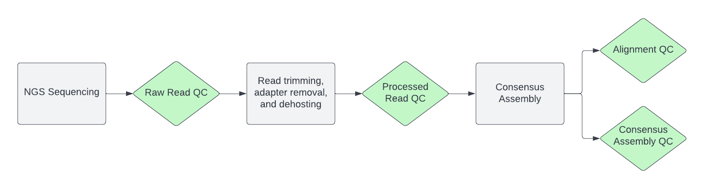

# **QC Solutions for SARS-CoV-2 Genomic Analysis**

**PHA4GE Bioinformatics Pipelines &amp; Visualization Working Group**  
Libuit KG, Lunn S, Carleton H, Khan W, Kanwar S, van Heusden P, Amrosio F, Lemmer D, Mboowa G, Macori G, Southgate J 

 
 Document Change Log

 
- {date}:
  - First draft published

# Overview

Next-generation sequencing (NGS) has expanded the approach of genomic analysis for pathogen surveillance systems. The demand for NGS continues to grow, with the need for high throughput, lower costs, and better quality of data. 

However, the quality of NGS sequencing data can be affected by library preparation and sequencing processes, systematic variation in quality scores across sequence reads, biases in sequencing due to base composition, and less-than optimal library fragment sizes and indexes. Such factors can negatively impact the quality of raw sequencing data for downstream analyses. 

In an attempt to assist with quality control (QC) measures, the bioinformatics pipeline and visualization working group of the Public Health Alliance for Genomic Epidemiology (PHA4GE) has drafted this living document to help define the QC challenges for SC2 genomic analysis and suggest a QC systems solutions to address them.

Please note that the QC guidelines in this document are simply an attempt to highlight the most accessible solutions **as per the opinions of our working group** and in no way represent a comprehensive system for QC guidance and bioinformatic solutions. If this document fails to include a valuable public health resource or in some way mischaracterizes a resource mentioned, we encourage community collaboration through pull-requests and/or raised GitHub issues. 

## Contents
- [Process Control For Bioinformatics QC Checkpoints](#process-control-for-bioinformatics-qc-checkpoints)
- [QC Metric Definitions](#qc-metric-definitions)
	- [Read QC Metrics](#read-qc-metrics)
	- [Alignment QC Metrics](#alignment-qc-metrics)
	- [Consensus Assembly QC Metrics](#consensus-assembly-qc-metrics)
	- [Educational Resources](#educational-resources)
- [Community-Defined Guidance Thresholds](#community-defined-guidance-thresholds)
    - [GISAID Assembly Acceptance Criteria](#gisaid-assembly-acceptance-criteria)
    - [NCBI GenBank Assembly Acceptance Criteria](#ncbi-genbank-assembly-acceptance-criteria)
    - [PHA4GE Suggested Thresholds](#pha4ge-suggested-thresholds)
    - [Alternative Validation](#alt-validation)
 - [Available Tools](#available-tools) 

# Process Control For Bioinformatics QC Checkpoints

Quality Control checkpoints should be conducted at different stages of bioinformatics analysis, including QC of raw read data, pre-processing stages (trimming and filtering), and alignment/assembly.

  

# QC Metric Definitions

## Read QC Metrics

Different sequencing platforms use different technologies to determine the nucleotide sequence of the genetic material that they are processing, but all of these technologies converge on the fastq file format. For example, Illumina uses a sequencing-by-synthesis approach which involves assembling copies of each read using fluorescently tagged nucleotides and taking high resolution pictures of each read as each nucleotide is added to the read. These images are then captured in binary base call (BCL) files, and BCL files are converted into fastq files using the bcl2fastq program. On the other hand, Oxford Nanopore Technologies sequencing platforms run single strands of nucleic acids through nano-scale protein pores. An electric current is run across the pore, and the changes in current are detected as each nucleotide passes through the pore. The raw electric signal is captured in the fast5 file format and converted into fastq file format using the basecalling program guppy. Due to the nature of these sequencing platforms there are different considerations when assessing the quality of the raw sequence data (the fastq files).

| Term                  | Definition                             |
| ---------------------- | --------------------------------------- |
| Reads | fragments of sequence DNA base pairs that are generated during sequencing; also referred to as the raw data generated from a sequencing platform |
| BCL files | raw image files produced by Illumina instruments, converted to fastq via bcl2fastq program |
| FAST5 files | raw electrical signal files produced by Oxford Nanopore Technologies sequencing equipment, converted to fastq via basecalling software (guppy is the current industry standard) |
| FASTQ files | The common “raw” sequence files containing nucleotide sequences and their associated quality scores    &bull; The quality scores contained within a fastq file are encoded as ASCII characters so that they require one bit per score making the string of nucleotide sequences and the string of quality scores equal in length   &bull; The quality score (Q Score) represents the probability of an accurate base assignment at the associated nucleotide position   &bull; Q scores range from 0 to 40 and are mathematically equivalent to:  &nbsp;&nbsp;&nbsp;&nbsp; <pre> Q = -10log10P</pre> &bull; [Quality Scores for Next-Generation Sequencing - illumina](https://www.illumina.com/documents/products/technotes/technote_Q-Scores.pdf)  &bull; [Measuring sequencing accuracy - illumina](https://emea.illumina.com/science/technology/next-generation-sequencing/plan-experiments/quality-scores.html)   &bull; Q Scores for Illumina and ONT sequencing will differ dramatically  &nbsp;&nbsp;&nbsp;&nbsp; &bull; An excellent Illumina run will have an average Q Score of 27-30  &nbsp;&nbsp;&nbsp;&nbsp; &bull; An excellent Nanopore run will have an average Q Score of 12-15   &bull; Low Q Scores indicate poor sequencing quality which will impact all downstream analyses | 
| Ambiguity / Mixed Sites | The percent of each read where the base called is ambiguous   [IUPAC Codes](https://www.bioinformatics.org/sms/iupac.html) |
| Sequence GC Content | The GC content of reads should be normally distributed |
| Raw vs Processed reads | It is typical for some reads to be removed during quality filtering. Based on the known characteristics of the sample, one should be able to predict a reasonable proportion of the reads to be removed.|

## Alignment QC Metrics

| Term                  | Definition                             |
| ---------------------- | --------------------------------------- |
| Sequence alignment  | a method of arranging nucleic acid (DNA/RNA) or protein sequences to identify regions of similarity or conservation that may be of function, structural, or evolutionary relationships. Pairwise sequence alignment consists of two sequences whereas multiple sequence alignment consists of more than three sequences |
|Sequencing depth | the number of reads that cover a particular nucleotide, section/amplicon of the genome, or average across the reference sequence   &bull; Ideally a min depth of 10X for Illumina or 20X for Nanopore would be reached &bull; Uniform depth of coverage is better  &bull; Nonuniform depth may be indicative of differential amplification of amplicons, or amplicon dropout  &nbsp;&nbsp;&nbsp;&nbsp;&bull; This can be assessed using bedtools |
| Coverage | What percent of the reference sequence is covered by the reads that have been produced  &bull; This metric is typically used in conjunction with depth |

## Consensus Assembly QC Metrics

| Term                  | Definition                             |
| ---------------------- | --------------------------------------- |
| Basecalling | The computational process of translating raw electrical signal files (FAST5) or flowcell images (BCL) to nucleotide sequence  [Performance of neural network basecalling tools for Oxford Nanopore sequencing](https://pubmed.ncbi.nlm.nih.gov/31234903/) |
| Length of the assembly | Should be similar to that of reference. If it is not, why? Have there been large insertions/deletions, gene duplications, etc.| 
| Total number of N’s | The total number of ambiguous basecalls in the assembly |
| Length of strings of N’s | While the total number of N’s is important, the length of the strings of N’s can indicate issues with upstream laboratory workflows. If a string of N’s is consistently reported over a specific region of the genome, then one can cross reference the primer binding loci in the bed file to see if one amplicon is dropping out or amplifying at a lower rate than the other amplicons. This could be due to amplification bias, resulting from a large differential in the GC content between the amplicons. This may also indicate that you have a mixed population and there may be a subpopulation with a different sequence in the ambiguous region.|

## Educational Resources

- [TheiaCoV QC output Video](https://www.youtube.com/watch?v=Amb-8M71umw&list=PLU47xRg_MKJrtyoFwqGiywl7lQj6vq8Uz&index=3)

- [StaPH-B Glossary](http://www.staphb.org/resources/glossary/)

- [PHA4GE Bioinformatics Solutions](https://github.com/pha4ge/pipeline-resources/blob/main/docs/bioinfo-solutions.md)

- [ECDC: Guidance for representative and targeted genomic SARS-CoV-2 monitoring](https://www.ecdc.europa.eu/sites/default/files/documents/Guidance-for-representative-and-targeted-genomic-SARS-CoV-2-monitoring.pdf)

# Community-Defined Guidance Thresholds

## GISAID Assembly Acceptance Criteria

## NCBI GenBank Assembly Acceptance Criteria

## PHA4GE Suggested Thresholds

|                            QC Metrics                           | Suggested guidance thresholds |
| ---------------------------------------------------------------|----------------------------- |
| **Read QC Metrics**                                             |                               |
| Percent Human Reads                                             | <20%                          |
| Number of reads                                                 | protocol dependent            |
| NTC percent coverage                                            | <10%                          |
| **Assembly QC metrics**                                         |                               |
| Percent reference coverage                                      | >83%                          |
| Number of Ns                                                    | <5,000bp                      |
| Assembly length unambiguous                                     | >24,000bp                     |
| Average coverage                                                | 100x                          |
| **Consensus Genome Calling**                                    |                               |
| Read depth                                                      | 20x (ONT); 10x (Illumina)     |
| Percent agreement                                               |  80%                          |
| **Variant Calling**                                             |                               |
| Reads depth at each position                                    | ≥5                            |
| Average base quality                                            | ≥15                           |
| Reads at the position supporting the call                       | ≥75%                          |
| For paired-end Illumina sequencing, read in forward orientation | at least 1                    |
| For paired-end Illumina sequencing, read in reverse orientation | at least 1                    |
| **Initial sample QC**                                             |                               |
| Specimens before going to NGS workflow                            | Ct <30                        |
| Sequenced multiple dilutions of viral isolates                    | Cts ranging from 14-35        |
| **QC thresholds for NGS workflow**                                |                               |
| **Per sample QC metrics**                               |                               |
| Average coverage depth                                            | ≥100                          |
| Coverage at a single base to make a base call                     | ≥ 50x                         |
| Percent genome coverage                                           | ≥ 95%                         |
| Lineage defining mutations                                        | ≥ 60%                         |
| Percent mapped reads to Wuhan reference genome                    | ≥ 65%                         |
| Total reads                                                       | ≥ 100,000                     |
| Number of open reading frames identified                          | ≥ 10                          |
| Percent ambiguous base calls                                      | < 5%                         |
| **QC thresholds for negative and positive controls**              |                               |
| Coverage of Wuhan reference                                       | < 10%                         |
| **QC thresholds to assign Spike protein substitutions**           |                               |
| S-gene coverage                                                   | 99%; 95% for N-terminal domain coverage |
| Wuhan reference sequence                                          | at least 50x read coverage    |
|  ambiguous bases detected in the consensus assembly for ed S-gene | No more than 10%              |
| Frameshift in the S-gene consensus sequence                       | 0                           |

# Available Tools

- [ncov-tools](https://www.google.com/url?q=https://github.com/jts/ncov-tools&sa=D&source=docs&ust=1654260267077931&usg=AOvVaw2IVI8lkio5wig20ajxX-b5)
- [Quality Management Systems Tools & Resources - Process Management](https://www.cdc.gov/labquality/qms-tools-and-resources.html#:~:text=Click%20to%20expand-,Process%20Management,-Provides%20guidance%20on)