# **Identifying SARS-CoV-2 Recombinants**

**PHA4GE Bioinformatics Pipelines &amp; Visualization Working Group**  
Smith E, Wright S, Libuit K

 
 Document Change Log

 
- {date}:
  - First draft published

# Overview
SARS-CoV-2 recombinants have garnered the attention of the public health community largely due to the unknown clinical and epidemiological implications. This uncertainty emphasizes the need to detect and characterize recombinant SARS-CoV-2 genomes, but the ability to do so rapidly and systematically is not without challenges. Often, recombinant genomes receive an “Unassigned” pango lineage, a non-recombinant pango lineage, or the incorrect recombinant lineage assignment. Additionally, determining the site of recombination within the genome can be difficult for those without extensive SARS-CoV-2 bioinformatics experience. 

The PHA4GE Pipelines and Visualization Working Group has created this document as an attempt to highlight critical sources of information and open-source/access resources to aid in the analysis and surveillance of potential recombinant specimens.

In no way does this document represent a comprehensive list of all available SC2 bioinformatics resources for assessing recombination. If this document fails to include a valuable public health resource or in some way mischaracterizes a resource mentioned, we encourage community collaboration through pull-requests and/or raised GitHub issues

## Contents
- [General Information](#general-information)
- [Publications on SARS-CoV-2 recombinants](#publications-on-sars-cov-2-recombinants)
- [Tools used to detect recombinants/find breakpoint](#tools-used-to-detect-recombinants/find-breakpoint)
- [Investigating Putative Recombinant Specimen](#investigating-putative-recombinant-specimen)
    - [Common terminology](#common-terminology)
    - [Steps for investigating putative recombinant genomes](#steps-for-investigating-putative-recombinant-genomes)
        - [Assess whether recombination exists within the genome](#steps-for-investigating-putative-recombinant-genomes)
        - [Determine whether the genome belongs to a designated recombinant lineage or represents a novel recombinant lineage](#determine-whether-the-genome-belongs-to-a-designated-recombinant-lineage-or-represents-a-novel-recombinant-lineage)
        - [Identify the breakpoint of the putative recombinant](#identify-the-breakpoint-of-the-putative-recombinant)
    - [Proposing a new recombinant lineage](#proposing-a-new-recombinant-lineage)

        

# General Information

More info and resources on recombinants

# Publications on SARS-CoV-2 recombinants

# Tools used to detect recombinants/find breakpoint

- [Sc2rf](https://github.com/lenaschimmel/sc2rf)
- [Nextclade](https://clades.nextstrain.org/)
- [UShER](https://clades.nextstrain.org/)
- [Potential Recombinant List - Sakaguchi Hitoshi](https://docs.google.com/spreadsheets/d/1cQILRxXD756gJoRsaqMdJkxZm7sEjhV7ceY398Iz7gI/edit#gid=0)

# Investigating Putative Recombinant Specimen

## Common terminology

| Term                  | Definition                             |
| ---------------------- | --------------------------------------- |
| Breakpoint | the site within the genome where recombination occurred. This is also sometimes referred to as the recombinant site. Usually, the breakpoint is a range of nucleotide positions instead of a single nucleotide position. This is due to a lack of lineage-specific mutations in certain regions, or the same mutations being shared between different lineages. The beginning of the breakpoint range is the first possible site within the genome that recombination could have occurred, which generally follows a lineage-specific mutation site. The end of the breakpoint range is the last possible site where the recombination could have occurred, which generally precedes the site of a lineage-specific mutation. |
| Donor | the lineage from which a portion of the recombinant genome originated. This is also called the “parental lineage”. For example, a BA.1 x BA.2 recombinant has BA.1 and BA.2 donor sequences.  |
| Designated lineage  | a specific pango lineage. Designated recombinant lineages are currently referred to with the XX nomenclature per the pango network [guidelines](https://www.pango.network/the-pango-nomenclature-system/statement-of-nomenclature-rules/). If a recombinant sequence does not belong to a designated recombinant lineage, it may be a novel recombinant lineage that has not yet been designated |
| Allele frequency | the proportion of reads that contain a specific nucleotide at a specific position within the genome. Ideally, the nucleotide sites for lineage-defining mutations within a recombinant genome will have near 100% allele frequency. This is one way to distinguish a recombinant genome from a contaminated genome. |
| Sequencing depth | the number of reads covering a specific position within the genome. This is also often referred to as “coverage”. Ideally, a recombinant genome will have high sequencing depth at the sites of lineage-defining mutations. If a genome has low sequencing depth, it is difficult to determine what the donor, or parental lineage, is at that site. |

## Steps for investigating putative recombinant genomes

There are three main steps in investigating a putative SARS-CoV-2 recombinant genome:  

1. Assess whether recombination exists within the genome 
2. Determine whether the genome belongs to a designated recombinant lineage or represents a novel recombinant lineage
3. Identify the breakpoint of the putative recombinant (if it represents a novel recombinant lineage)

### Assess whether recombination exists within the genome

#### 1. Run genome assembly through Nextclade. This can be done either through the [Nextclade web portal](https://clades.nextstrain.org/) or [NextClade CLI](https://docs.nextstrain.org/projects/nextclade/en/stable/user/nextclade-cli.html) (command-line interface).

#### 2. Assess Nextclade output for sequence quality and potential for recombination.

##### Example 1

This genome (EPI_ISL_11758210) received a clade assignment of “recombinant” using v1.14.1. It has 67 mutations relative to the Wuhan-1 reference genome. It also has 0 Ns, meaning that there are no ambiguous bases in the genome and it is likely a high quality genome assembly. Therefore, we can be confident that this sequence is a true recombinant. However, additional investigation will be needed to determine whether this genome actually belongs to the XQ recombinant lineage. 

  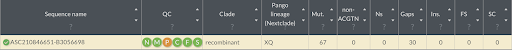

##### Example 2

This genome (EPI_ISL_12612634) received a clade assignment of “recombinant” using v1.14.1. It has 64 mutations relative to the Wuhan-1 reference genome. It has 646 N’s, which means ~2% of the genome assembly is composed of Ns. While any ambiguous bases in the genome assembly are not ideal, it is not abnormal. This is still a relatively low number of N’s and we can have confidence that this genome is a recombinant. However, additional investigation will be needed to determine whether this genome actually belongs to the XE lineage.

  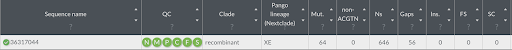

##### Example 3

This genome received a clade assignment of “recombinant” using v1.14.1. It has 10 mutations relative to the Wuhan-1 reference genome. It has 21,498 Ns, meaning that the majority of the genome assembly is composed of ambiguous bases. Despite the “recombinant” assignment and “XF” pango lineage, the quality of this sequence is too poor to continue investigating for recombination. 

  

### Determine whether the genome belongs to a designated recombinant lineage or represents a novel recombinant lineage

#### 1. Upload sequences to the [UShER web portal](https://genome.ucsc.edu/cgi-bin/hgPhyloPlace). To follow along with Examples 1 and 2, you can either upload the fasta files or copy and paste the GISAID accessions.

#### 2. Review UShER outputs and subtrees

##### Example 1

This genome was given a lineage assignment of BA.2 by UShER. This differs from the Nextclade lineage assignment of XQ, which is a bit confusing.  On the UShER subtree, this genome falls into a clade of similar sequences, but all of them are assigned the BA.2 lineage. This means that this genome will need further investigation. Since this sequence was high quality, determined to be a recombinant by Nextclade, but was not assigned a recombinant pango lineage in UShER, it may belong to a novel recombinant lineage that has not been designated.

  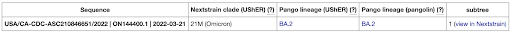

  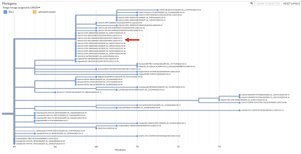

##### Example 2

This genome was given a lineage assignment of XE by UShER. When viewing the UShER subtree, this sequence falls amongst many other XE genomes. In fact, it is nearly identical to several other genomes in the public repositories. Therefore, this genome is likely a true XE recombinant. Since this genome belongs to a designated recombinant lineage that has been previously characterized, no further investigation is necessary. 

  

  

### Identify the breakpoint of the putative recombinant

#### 1. Return to Nextclade output

When in doubt, always go back to the list of mutations! While looking at individual mutations can be a slow and manual process, it is the best way to determine the breakpoint of the putative novel recombinant genome. You can hover over the number of mutations in the web portal to get a graphical display of the mutations, or you can download the list of mutations as a JSON, CSV, or TSV.

  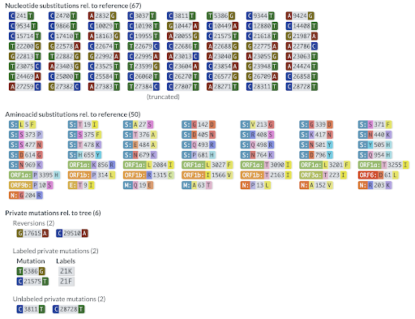

  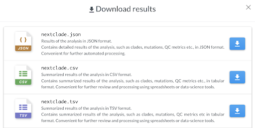

#### 2. Find list of defining mutations for each variant

Lists of mutations for each variant can be found on the [CoVariants web page](https://covariants.org/variants/21K.Omicron). When you click on a specific variant, a list of defining mutations will appear on the right side of the page. Be aware that several variants share defining mutations.

  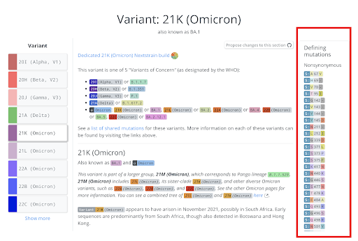

  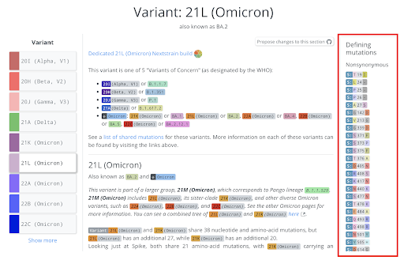

#### 3. Determine which mutations within the putative novel recombinant genome belong to which donors

Go mutation-by-mutation and determine whether that mutation is specific to 21K (BA.1) or 21L (BA.2). It is also important to check to see if lineage-specific mutations are missing from the genome. Starting in ORF1a with Example 1, the genome contains ORF1a:K856R and ORF1a:L2084I, which are both specific to 21K (BA.1). However, with a BA.1 genome we would expect the next amino acid substitution to be ORF1a:A2710T based on the list from CoVariants. Instead, the two amino acid substitutions are ORF1a:L3027F and ORF1a:T3090I, which are both specific to 21L (BA.2). This means that the breakpoint for this recombinant genome is between ORF1a:L2084I and ORF1a:A2710T, which corresponds to 6,516-8,392bp. 

  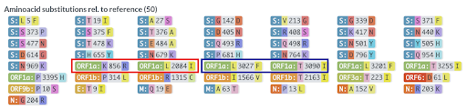

  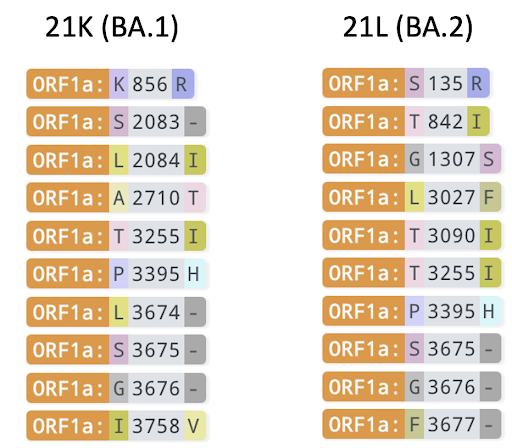

In this case, the breakpoint was at two sites that confer amino acid substitutions, however, some cases will require looking at synonymous nucleotide changes as well. [CoVariants](https://covariants.org/) lists these underneath the list of amino acid substitutions. 

  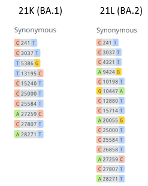

## Proposing a new recombinant lineage:

The pango team recently released a set of [guidelines](https://www.pango.network/pango-lineages-guidelines-for-suggesting-novel-and-recombinant-lineages/) for proposing new recombinant lineages. 